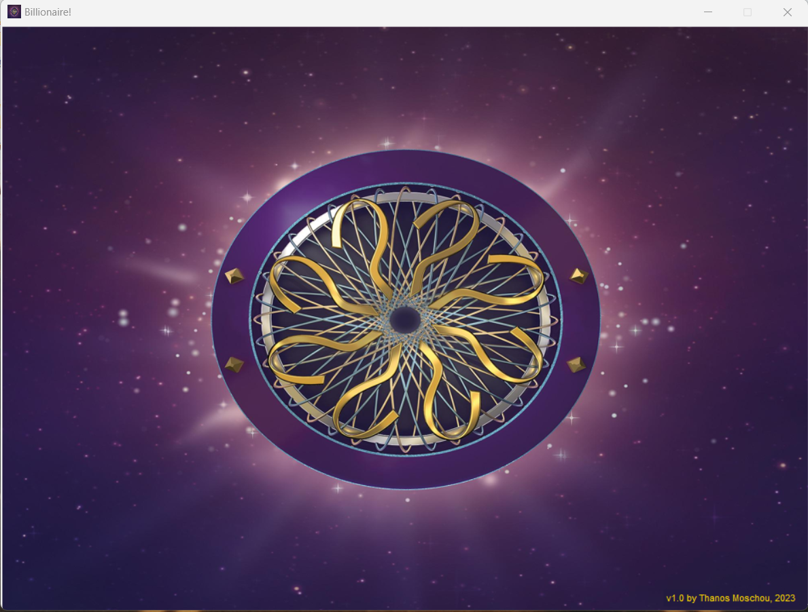
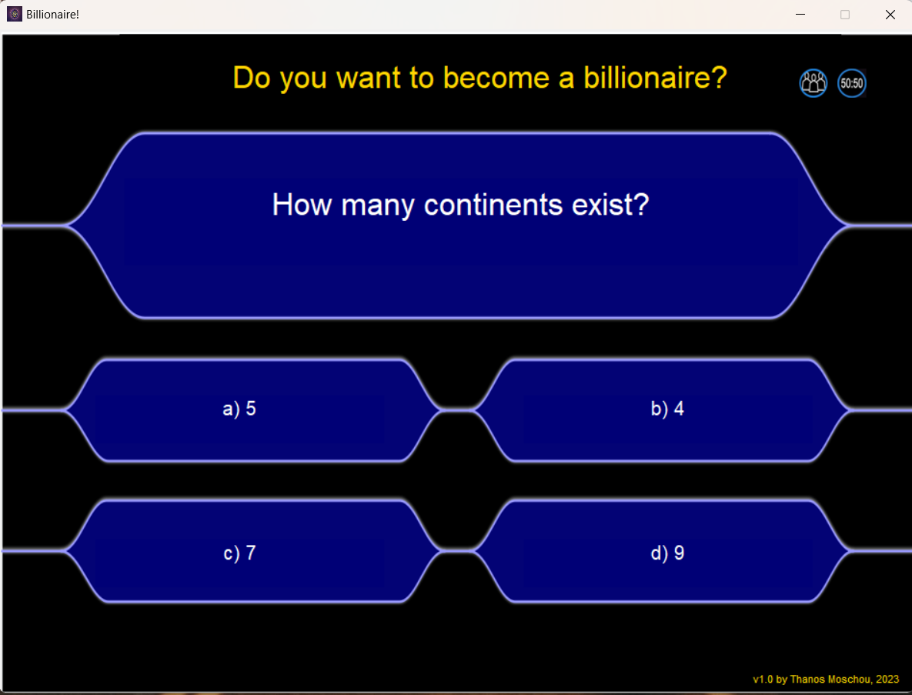

## Do you want to become a Billionaire

This is an imitation of the famous show ```Who wants to be a millionaire``` built with tkinter module. It also uses mixer module of pygame.

## 📷 Screenshots


### Main screen



### How to run it
You need python installed on your PC. <br>
Open the project's folder in a terminal. If it is the first time you're running this app, you will need to download all the required modules that app uses. Simply type:

```
pip install -r requirements.txt 
```

The next time you run the app, you don't have to run the previous command, because all the modules are now downloaded.<br>

Then type:

```
python3 billionaire.py 
```
to start the app.<br>

You can change the questions if you want. The questions in the file ```questions.txt``` have the following format:
```
Question
a) Answer A
b) Answer B
c) Answer C
d) Answer D
Correct answer (only the letter for example if the correct answer is A, this line has the letter a)
```

For the best experience make sure every question is 1 line long and each answer is 1-2 words long.
